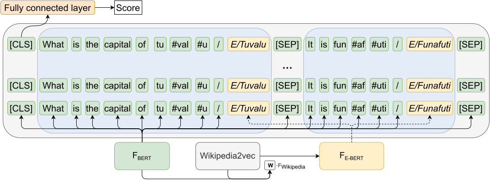

# EMBERT



## About this repository

Github page with supplementary information to the paper `Entity-aware Transformers for Entity Search' by Emma Gerritse, Faegheh Hasibi and Arjen de Vries, which was accepted at SIGIR 2022, and can be accessed [here](https://arxiv.org/abs/2205.00820)

## Structure 
Structure of this github repository is as follows:
In the Runs Directory, you can find all runs in the paper, with the same name as in the paper table 2. 

In the Code directory, all code is available. All models and supplementary materials can be downloaded by running

```
cd Code
sh make.sh
```

Note that this will download around 40 gb of data.

All Python packages can be downloaded with `pip install -r requirements.txt`

## Reranking

To rerank, call the following function:

```
python pygaggle/run/evaluate_passage_ranker.py  --split dev --method seq_class_transformer --model pathtomodel --dataset pathtodataset  --index-dir pathtoindex  --task msmarco --output-file runs/testrun.tsv
```


## More information 

Most of the code is based on either the [E-BERT](https://github.com/NPoe/ebert) or the [Pygaggle](https://github.com/castorini/pygaggle) repository.

To use on your own datasets, make sure to provide all documents and queries as in the pygaggle repository, but annotate the documents before the index and the queries. Annotations should come right after the mention, for example `Neil Gaiman ENTITY/Neil_Gaiman novels`. We used [REL](https://github.com/informagi/REL), but you can use entity linker as long as the part after the `ENTITY` preamble is a Wikipediapage.

An example of finetuning can be found in `Code/retraining_dbpedia_entity_folds.py`.


## Downloads

Everything needed to evaluate the model can be downloaded with the script in `Code/make.sh`
If you just want the seperate models or Lucene indexes, they can be downloaded here.

[TSV of DBpedia Entity](https://surfdrive.surf.nl/files/index.php/s/fT0R5czH4hmIlgw/download)

[TSV of DBpedia Entity Annotated](https://surfdrive.surf.nl/files/index.php/s/hjMd4zYYn3VXoRM/download)

[Lucene index for DBpedia Entity](https://surfdrive.surf.nl/files/index.php/s/K4TWcIWLHvDhrOK/download)

[Lucene index for DBpedia Entity annotated](https://surfdrive.surf.nl/files/index.php/s/ItjlwVhm8sApcZS/download)

[Wikipedia2vec embeddings](https://surfdrive.surf.nl/files/index.php/s/mOYK4gZfI3yjsZd/download)

[EMBERT finetuned on Annotated Dbpedia, all 5 folds](https://surfdrive.surf.nl/files/index.php/s/gfCY1dc5CdkbS5S/download)

[MonoBERT fintetuned on DBpedia, not annotated, all 5 folds](https://surfdrive.surf.nl/files/index.php/s/5KQIRtiKikObJDG/download)

[EMBERT fintetuned on MSMARCO (EMBERT (1st) in paper)](https://surfdrive.surf.nl/files/index.php/s/eJsvZLceqi6kPeY)


## Citation and contact

You can cite us using 

```
@inproceedings{Gerritse:2022:Entity,
author = {Gerritse, Emma and Hasibi, Faegheh and De Vries, Arjen},
booktitle = {Proc. of the 45th International ACM SIGIR Conference on Research and Development in Information Retrieval},
series = {SIGIR '22},
title = {{Entity-aware Transformers for Entity Search}},
year = {2022}
}
```

In case anything is missing, please either make an issue or send an emal to emma.gerritse@ru.nl


